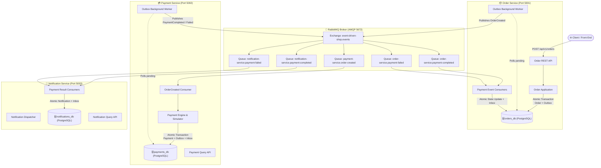
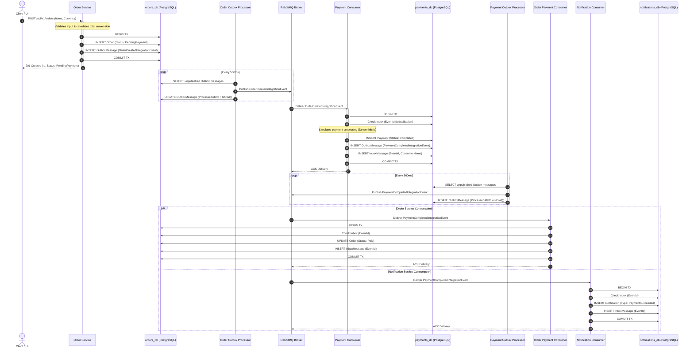
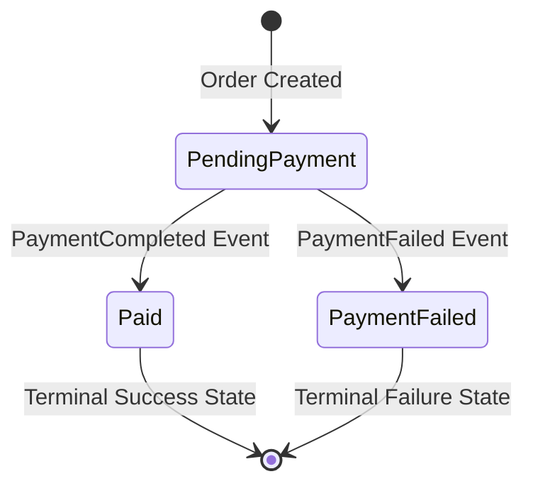
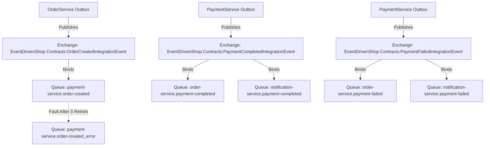

# EventDrivenShop

> **Production-Oriented, Portfolio-Quality Event-Driven Microservices in .NET 9**  
> Built with C# 13, ASP.NET Core, PostgreSQL, RabbitMQ, MassTransit, OpenTelemetry, Serilog, and xUnit.

[](https://github.com/your-username/EventDrivenShop/actions/workflows/ci.yml)
[](LICENSE)
[](https://dotnet.microsoft.com/)

---

## Table of Contents
1. [Why This Project Exists](#why-this-project-exists)
2. [System Architecture](#system-architecture)
3. [Asynchronous Event Flow](#asynchronous-event-flow)
4. [Service Boundaries & Data Isolation](#service-boundaries--data-isolation)
5. [Integration Event Contracts](#integration-event-contracts)
6. [Message Delivery Guarantees](#message-delivery-guarantees)
7. [The Transactional Outbox Pattern](#the-transactional-outbox-pattern)
8. [The Inbox Pattern & Idempotency](#the-inbox-pattern--idempotency)
9. [Distributed Failure Handling Matrix](#distributed-failure-handling-matrix)
10. [Eventual Consistency & State Transitions](#eventual-consistency--state-transitions)
11. [Correlation IDs & Observability](#correlation-ids--observability)
12. [RabbitMQ Message Topology & Error Handling](#rabbitmq-message-topology--error-handling)
13. [Database Design & Constraints](#database-design--constraints)
14. [Testing Strategy](#testing-strategy)
15. [Getting Started (Docker & Local)](#getting-started-docker--local)
16. [Simulating Failures (Hands-On Exercises)](#simulating-failures-hands-on-exercises)
17. [Architectural Decisions & FAQs](#architectural-decisions--faqs)
18. [Trade-offs & When NOT to Use This Architecture](#trade-offs--when-not-to-use-this-architecture)
19. [Future Production Enhancements](#future-production-enhancements)
20. [License](#license)

---

## Why This Project Exists

Most distributed system tutorials and online demos showcase trivial messaging: one API pushes a raw message directly to a message broker during an HTTP request, and a second API prints that message to the terminal.

In real-world enterprise production environments, this naive approach causes severe data corruption:
- **Dual-Write Pitfalls**: If the database commits but the network call to the message broker fails, messages are permanently lost.
- **Lost Updates & Outages**: If the message broker is down during an order checkout, the client receives a 500 error or transactions get stranded.
- **Duplicate Processing & Double Charges**: Network retries cause the same message to arrive multiple times, leading to duplicate payments or corrupted order states.
- **Tight Coupling & Monolithic Databases**: Services sharing database tables violate bounded contexts and make independent zero-downtime deployment impossible.

**`EventDrivenShop` was built from scratch to demonstrate real distributed systems engineering** in .NET 9. It models an asynchronous order processing flow with three autonomous microservices practicing strict **database-per-service**, **transactional outbox**, **inbox deduplication**, **idempotency**, **retries/dead-lettering**, and **end-to-end correlation**.

---

## System Architecture



---

## Asynchronous Event Flow



---

## Service Boundaries & Data Isolation

Each microservice is completely autonomous, has its own dedicated codebase, and owns its persistence:

| Microservice | Bounded Context | Database Name | Owned Tables | Dependencies |
| :--- | :--- | :--- | :--- | :--- |
| **Order Service** | Order lifecycle, order totals, status transitions | `orders_db` | `Orders`, `OrderItems`, `OutboxMessages`, `InboxMessages` | None |
| **Payment Service** | Payment authorization, payment state, settlement | `payments_db` | `Payments`, `OutboxMessages`, `InboxMessages` | None |
| **Notification Service** | Customer notifications, delivery auditing | `notifications_db` | `Notifications`, `InboxMessages` | None |

> [!IMPORTANT]
> **Strict Database-Per-Service Rule**: No service ever queries or modifies another service's database directly. Communication between microservices occurs **exclusively via asynchronous integration events** over RabbitMQ.

---

## Integration Event Contracts

Contracts represent the stable public interface between bounded contexts and reside in `EventDrivenShop.Contracts`. Domain entities and database contexts are never leaked to the message bus.

### 1. `OrderCreatedIntegrationEvent`
Emitted by `OrderService` when an order is created.
```json
{
  "eventId": "a87e3f8a-4933-4f9e-a612-e87a26f63be0",
  "occurredAtUtc": "2026-09-06T19:00:00.0000000Z",
  "correlationId": "corr-8f12c8a7-5421-4d9b-a0fb-365261dfbe21",
  "orderId": "3fa85f64-5717-4562-b3fc-2c963f66afa6",
  "customerId": "7c9e6679-7425-40de-944b-e07fc1f90ae7",
  "customerEmail": "customer@example.com",
  "totalAmount": 170.00,
  "currency": "USD",
  "items": [
    {
      "productId": "e1f13b77-d61b-4fbf-9310-410a56e02611",
      "productName": "Mechanical Keyboard",
      "quantity": 1,
      "unitPrice": 120.00,
      "totalPrice": 120.00
    },
    {
      "productId": "c3b88a91-4471-4774-8b65-bf97cf54291c",
      "productName": "Desk Mat",
      "quantity": 2,
      "unitPrice": 25.00,
      "totalPrice": 50.00
    }
  ]
}
```

### 2. `PaymentCompletedIntegrationEvent`
Emitted by `PaymentService` upon successful payment authorization.
```json
{
  "eventId": "b90f4e12-3211-4cb3-87a1-2d7c449e0112",
  "occurredAtUtc": "2026-09-06T19:00:01.2500000Z",
  "correlationId": "corr-8f12c8a7-5421-4d9b-a0fb-365261dfbe21",
  "paymentId": "5da62bf1-f187-431a-ba73-51820b1350a4",
  "orderId": "3fa85f64-5717-4562-b3fc-2c963f66afa6",
  "amount": 170.00,
  "currency": "USD"
}
```

### 3. `PaymentFailedIntegrationEvent`
Emitted by `PaymentService` when payment authorization is declined.
```json
{
  "eventId": "f78d91c2-6789-4fa2-bcde-112233445566",
  "occurredAtUtc": "2026-09-06T19:00:01.5000000Z",
  "correlationId": "corr-fail-99381-4412",
  "paymentId": "77aa88bb-99cc-44dd-11ee-22ff33aa44bb",
  "orderId": "3fa85f64-5717-4562-b3fc-2c963f66afa6",
  "amount": 170.00,
  "currency": "USD",
  "reason": "Payment authorization declined: Insufficient funds / card declined."
}
```

---

## Message Delivery Guarantees

> [!CAUTION]
> **Distributed Systems Reality: The Architecture Does NOT Promise "Exactly-Once" Delivery.**
> 
> Across an unreliable network and distributed processes, **true exactly-once message delivery is physically impossible** without expensive distributed two-phase commit (2PC) locks that destroy scalability and availability.
> 
> A network crash can occur *after* RabbitMQ delivers an event but *before* the consumer's acknowledgment reaches RabbitMQ. RabbitMQ will redeliver the message. Therefore, all distributed systems operate under **At-Least-Once Delivery**.

### How `EventDrivenShop` achieves *Effectively-Once* Processing:
1. **The Outbox Pattern** ensures that no event is lost when a database commit succeeds.
2. **The Inbox Pattern** ensures that duplicate deliveries of the same `EventId` are safely detected and skipped.
3. **Database Unique Constraints** (`InboxMessages(EventId, Consumer)` and `Payments(OrderId)`) act as the atomic source of truth against race conditions.

---

## The Transactional Outbox Pattern

### The Dual-Write Problem
```
BAD NAIVE APPROACH:
1. db.Orders.Add(order);
2. await db.SaveChangesAsync(); // Transaction committed to PostgreSQL
3. await bus.Publish(new OrderCreatedEvent()); // CRASH! Network outage or app termination
Result: Order exists in database, but Payment Service never hears about it. Lost transaction.
```

### The Solution: Transactional Outbox
When an order is created, the `Order` aggregate and the `OutboxMessage` record are committed to PostgreSQL **in the exact same database transaction**:

```csharp
// Atomically committed in ONE local PostgreSQL transaction:
_dbContext.Orders.Add(order);
_dbContext.OutboxMessages.Add(OutboxMessage.FromEvent(orderCreatedEvent));
await _dbContext.SaveChangesAsync(cancellationToken);
```

An asynchronous background processor (`OutboxProcessorBackgroundService<TDbContext>`) polls pending messages in batches, dispatches them to RabbitMQ, and records `ProcessedAtUtc = DateTime.UtcNow`.

```csharp
var pendingMessages = await dbContext.OutboxMessages
    .Where(m => m.ProcessedAtUtc == null && m.RetryCount < MaxRetries)
    .OrderBy(m => m.OccurredAtUtc)
    .Take(20)
    .ToListAsync(cancellationToken);
```

---

## The Inbox Pattern & Idempotency

When a consumer receives an integration event, it uses its service database to deduplicate the message before executing business logic:

```csharp
const string consumerName = "PaymentService.OrderCreatedConsumer";

// 1. Inbox Deduplication check
var alreadyProcessed = await _dbContext.InboxMessages
    .AnyAsync(m => m.EventId == @event.EventId && m.Consumer == consumerName, cancellationToken);

if (alreadyProcessed)
{
    _logger.LogInformation("Duplicate Event {EventId} ignored via Inbox.", @event.EventId);
    return; // Idempotent exit
}

// 2. Business logic + Outbox + Inbox in one local transaction:
_dbContext.Payments.Add(payment);
_dbContext.OutboxMessages.Add(outboxMessage);
_dbContext.InboxMessages.Add(InboxMessage.Create(@event.EventId, consumerName));

await _dbContext.SaveChangesAsync(cancellationToken);
```

---

## Distributed Failure Handling Matrix

| Failure Scenario | Immediate System Behavior | Recovery Mechanism | Integrity Outcome |
| :--- | :--- | :--- | :--- |
| **RabbitMQ Temporarily Down** | Order API successfully commits Order + OutboxMessage to `orders_db`. HTTP client receives `201 Created`. | Outbox background worker retries publishing with backoff. Once RabbitMQ reconnects, pending messages are dispatched. | **Zero Data Loss**. Orders remain durable in PostgreSQL. |
| **Outbox Worker Crashes After Publish but Before DB Update** | Message was published to RabbitMQ, but `ProcessedAtUtc` was not saved. Upon worker restart, the message is published a second time. | Downstream consumer (`PaymentService`) checks its `InboxMessages` table and detects the duplicate `EventId`. | **Effectively-Once Execution**. Duplicate payment is prevented. |
| **Payment Service Crashes Mid-Processing** | Database transaction rolls back completely (no Payment, no Outbox, no Inbox). RabbitMQ message is unacknowledged. | RabbitMQ re-queues and delivers the event to another Payment Service instance. | **Zero State Corruption**. Transaction restarts cleanly. |
| **Duplicate Delivery of `PaymentCompleted`** | Order is already `Paid`. Notification was already created. | Order Service and Notification Service inbox checks identify duplicate `EventId` and exit early. | **No Duplicate Side Effects**. |
| **Poison Message (Invalid Payload / Bad Data)** | Consumer throws non-transient exception. MassTransit retries 3 times with incremental backoff. | After retry exhaustion, MassTransit automatically moves the poison message to an `_error` dead-letter queue. | **Queue Stoppage Prevented**. Other legitimate messages continue processing. |
| **PostgreSQL Database Unavailable** | Service readiness health check (`/health/ready`) reports `503 Service Unavailable`. HTTP requests fail gracefully with `ProblemDetails`. | Npgsql connection pool retries on failure. Once DB is reachable, services resume normal operation. | **Consistent State**. Uncommitted requests are rejected. |

---

## Eventual Consistency & State Transitions

When `POST /api/v1/orders` executes, the Order is created with status **`PendingPayment`**. The client receives a `201 Created` response immediately. The payment is processed asynchronously via messaging.

### Explicit State Transitions:


- **Enforced Invariants**: Transition from `Paid` to `PaymentFailed` is strictly prohibited by domain business logic. If a late or stale `PaymentFailedIntegrationEvent` arrives after an order was already marked `Paid`, an `InvalidOperationException` is thrown and the paid state is preserved.

---

## Correlation IDs & Observability

To trace a business transaction across multiple asynchronous boundaries, each request generates or propagates a `CorrelationId` through the entire flow:

```
[HTTP POST /api/v1/orders] (Header: X-Correlation-Id)
       │
       ▼
[OrderCreatedIntegrationEvent] (Payload.CorrelationId)
       │
       ▼
[PaymentService Consumer & Logs] (Enriched LogContext)
       │
       ▼
[PaymentCompletedIntegrationEvent] (Payload.CorrelationId)
       │
       ▼
[NotificationService Dispatch] (Traceable End-to-End)
```

### Identifier Distinctions:
- **`CorrelationId`**: Identifies the entire business transaction spanning multiple services and HTTP/AMQP hops.
- **`TraceId`**: The W3C distributed trace identifier tracked by OpenTelemetry across network boundaries.
- **`EventId`**: The unique identifier of a specific integration event instance (used for Inbox deduplication).
- **`OrderId` / `PaymentId`**: Business aggregate primary keys.

---

## RabbitMQ Message Topology & Error Handling



### Error & Poison Message Handling
- MassTransit automatically moves unresolvable messages to a dedicated `_error` queue (e.g. `payment-service.order-created_error`).
- Administrators can inspect the headers (`MT-Fault-Message`, `MT-Reason`) in RabbitMQ Management UI to identify the cause, fix downstream bugs, and safely replay the messages using standard RabbitMQ shovel plugins or MassTransit management endpoints.

---

## Database Design & Constraints

Each microservice maintains its own independent schema and migrations:

```
orders_db:
├── Orders (Id PK, CustomerId, CustomerEmail, TotalAmount, Currency, Status, CreatedAtUtc)
├── OrderItems (Id PK, OrderId FK, ProductId, ProductName, Quantity, UnitPrice)
├── OutboxMessages (Id PK, EventType, Payload, OccurredAtUtc, ProcessedAtUtc, RetryCount, CorrelationId)
└── InboxMessages (EventId PK, Consumer PK, ProcessedAtUtc)

payments_db:
├── Payments (Id PK, OrderId UNIQUE INDEX, Amount, Currency, Status, FailureReason, CreatedAtUtc)
├── OutboxMessages (Id PK, EventType, Payload, OccurredAtUtc, ProcessedAtUtc, RetryCount, CorrelationId)
└── InboxMessages (EventId PK, Consumer PK, ProcessedAtUtc)

notifications_db:
├── Notifications (Id PK, OrderId, Recipient, Type, Status, Content, CreatedAtUtc, ProcessedAtUtc)
└── InboxMessages (EventId PK, Consumer PK, ProcessedAtUtc)
```

---

## Testing Strategy

The solution contains **52 automated tests** across three test suites:

```
tests/
├── EventDrivenShop.UnitTests/         # 38 Tests: Domain invariants, state machines, validation rules, serializers
├── EventDrivenShop.IntegrationTests/  # 12 Tests: Outbox persistence, Inbox deduplication, MassTransit harness
└── EventDrivenShop.EndToEndTests/     #  2 Tests: Full asynchronous choreography & failure flows
```

### Running All Tests
```bash
dotnet test EventDrivenShop.sln
```

---

## Getting Started (Docker & Local)

### Prerequisites
- [.NET 9.0 SDK](https://dotnet.microsoft.com/download/dotnet/9.0)
- [Docker](https://www.docker.com/) & Docker Compose

### 1. Launch Everything via Docker Compose
```bash
docker compose up --build -d
```

### 2. Service Endpoints & Swagger UIs
| Component | Local URL | Description |
| :--- | :--- | :--- |
| **Order Service API** | http://localhost:5001/swagger | Order submission and query endpoints |
| **Payment Service API** | http://localhost:5002/swagger | Payment query endpoints |
| **Notification Service API**| http://localhost:5003/swagger | Notification inspection endpoints |
| **RabbitMQ Management** | http://localhost:15672 | Login: `guest` / `guest` |
| **Jaeger Tracing UI** | http://localhost:16686 | Distributed trace visualization |

---

## Simulating Failures (Hands-On Exercises)

### Exercise 1: Normal Asynchronous Success Flow
1. Open Order Service Swagger (`http://localhost:5001/swagger`) or run `curl`:
```bash
curl -X POST http://localhost:5001/api/v1/orders \
  -H "Content-Type: application/json" \
  -d '{
    "customerId": "3fa85f64-5717-4562-b3fc-2c963f66afa6",
    "customerEmail": "alice@example.com",
    "currency": "USD",
    "items": [
      {
        "productId": "e1f13b77-d61b-4fbf-9310-410a56e02611",
        "productName": "Mechanical Keyboard",
        "quantity": 1,
        "unitPrice": 120.00
      }
    ]
  }'
```
2. Copy the returned `id` (e.g. `order-id`). Notice the initial status is `"PendingPayment"`.
3. Query the order after 1-2 seconds: `GET http://localhost:5001/api/v1/orders/{order-id}`.
4. Notice status transitioned to **`"Paid"`**.
5. Query `GET http://localhost:5003/api/v1/notifications/by-order/{order-id}` and observe the confirmed notification.

---

### Exercise 2: Deterministic Payment Failure Simulation
1. Submit an order with customer email starting with `fail-payment`:
```bash
curl -X POST http://localhost:5001/api/v1/orders \
  -H "Content-Type: application/json" \
  -d '{
    "customerId": "3fa85f64-5717-4562-b3fc-2c963f66afa6",
    "customerEmail": "fail-payment@example.com",
    "currency": "USD",
    "items": [
      {
        "productId": "e1f13b77-d61b-4fbf-9310-410a56e02611",
        "productName": "Ergonomic Chair",
        "quantity": 1,
        "unitPrice": 350.00
      }
    ]
  }'
```
2. Query `GET http://localhost:5001/api/v1/orders/{order-id}`.
3. Observe status transitioned to **`"PaymentFailed"`** with failure reason `"Payment authorization declined: Insufficient funds / card declined."`.
4. Query `GET http://localhost:5003/api/v1/notifications/by-order/{order-id}` to observe the failure notification.

---

### Exercise 3: Broker Outage Resilience (Outbox Survives RabbitMQ Downtime)
1. Stop RabbitMQ:
```bash
docker compose stop rabbitmq
```
2. Submit a new order via `POST /api/v1/orders`.
3. Notice HTTP request **still succeeds with `201 Created`** because the order and outbox message are saved to PostgreSQL atomically!
4. Restart RabbitMQ:
```bash
docker compose start rabbitmq
```
5. Within seconds, the Outbox background worker publishes the pending event, Payment Service processes it, and Order transitions to `Paid`.

---

## Architectural Decisions & FAQs

### 1. Why Database-Per-Service?
Sharing a database creates hidden coupling, makes schema migrations dangerous across teams, and prevents independent database scaling. A database-per-service pattern enforces clean bounded contexts.

### 2. Why Asynchronous Messaging over Synchronous HTTP between Order & Payment?
If Order Service synchronously called Payment Service via HTTP:
- An outage or latency spike in Payment Service would cascade directly into Order Service.
- Temporary payment outages would prevent users from creating orders.
- Event-driven choreography provides temporal decoupling and fault isolation.

### 3. Why Not Claim Exactly-Once Delivery?
Because network partitions, consumer crashes after side-effect execution, and TCP acknowledgments cannot guarantee single delivery across distributed systems. Instead, we embrace At-Least-Once Delivery combined with **Idempotent Consumers via the Inbox pattern**.

### 4. Why No Generic Repository Pattern?
EF Core's `DbContext` and `DbSet<T>` already implement the Unit of Work and Repository patterns. Wrapping them in generic `IRepository<T>` layers adds ceremony and hides powerful query optimization features (e.g. `AsNoTracking`, SQL projections, batch operations).

### 5. Why Choreography Instead of a Saga Orchestrator?
For a 3-step linear flow (Order -> Payment -> Result Notification), event choreography is clean and lightweight. Orchestrator sagas introduce value when coordinating multi-step transactions with complex rollbacks, inventory reservations, shipping, and timeout compensations.

---

## Trade-offs & When NOT to Use This Architecture

### Trade-offs:
- **Eventual Consistency Complexity**: User interfaces must handle non-immediate state changes (e.g. polling, WebSockets, or optimism).
- **Inbox Storage Growth**: Processed message IDs require periodic cleanup policies.
- **Operational Overhead**: Requires managing RabbitMQ clusters, Dead-Letter queues, and distributed tracing backends.

### When NOT to Use Microservices:
If you are building a greenfield project with a small team (1-5 engineers), low traffic scale, or a rapidly evolving domain model, a **well-architected Modular Monolith is almost always superior**. Microservices should be adopted when independent deployment cadence, team autonomy, or differing scalability requirements justify the operational cost.

---

## Future Production Enhancements
- Kubernetes Helm charts with KEDA-based auto-scaling based on RabbitMQ queue depth.
- Managed Secret Store integration (Azure Key Vault / AWS Secrets Manager).
- OpenTelemetry Collector pipeline exporting to Grafana Tempo / Prometheus.
- Automated dead-letter queue message replay tooling with rate limiting.

---

## License
This project is open-source software licensed under the [MIT License](LICENSE).
